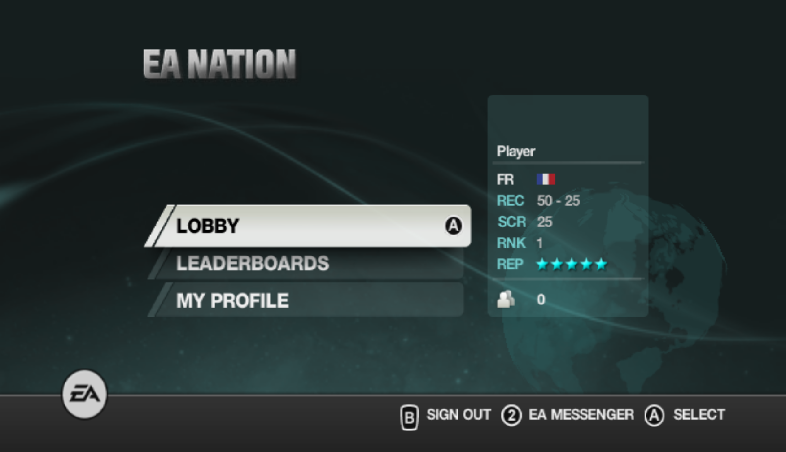
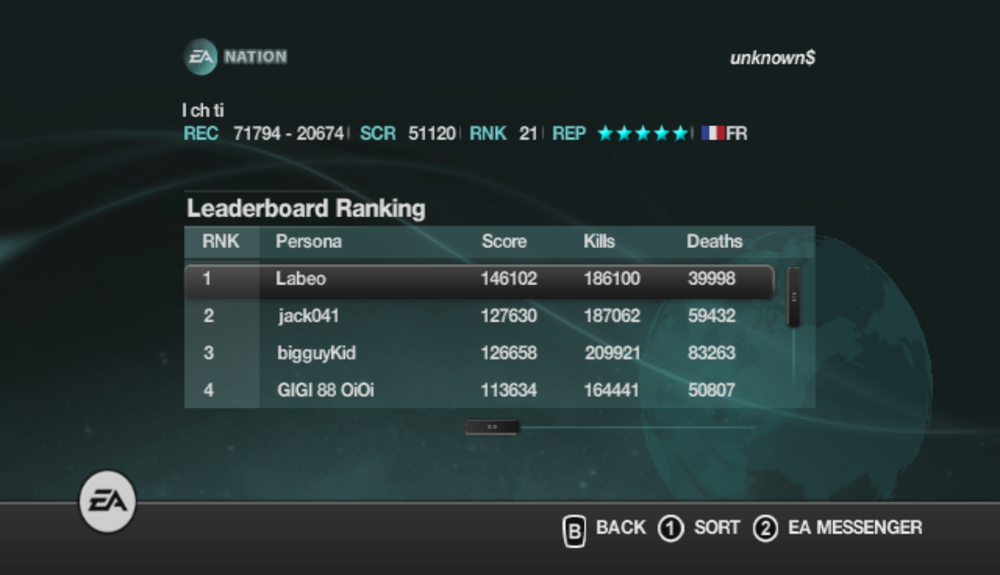
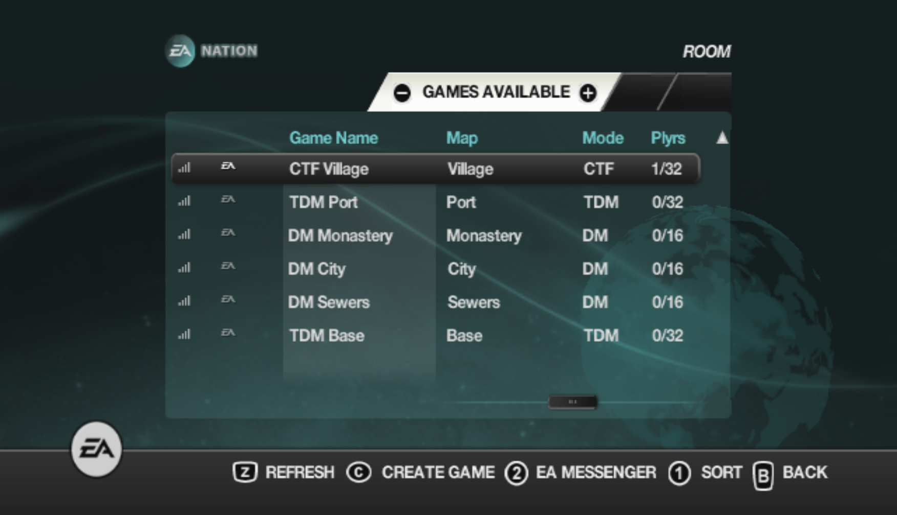
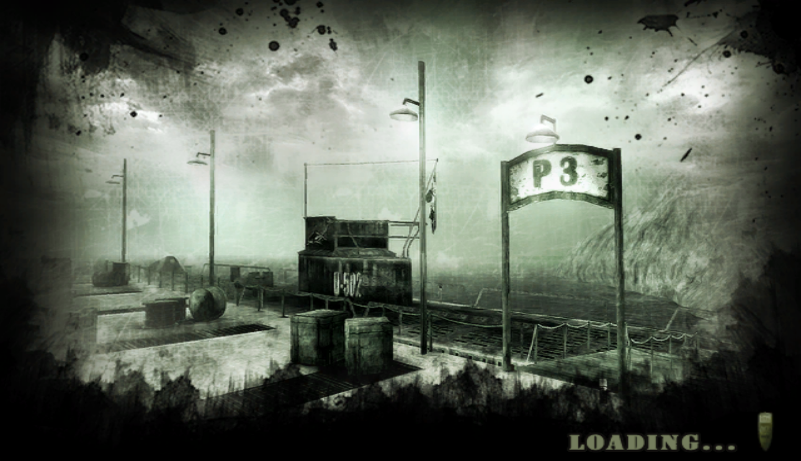
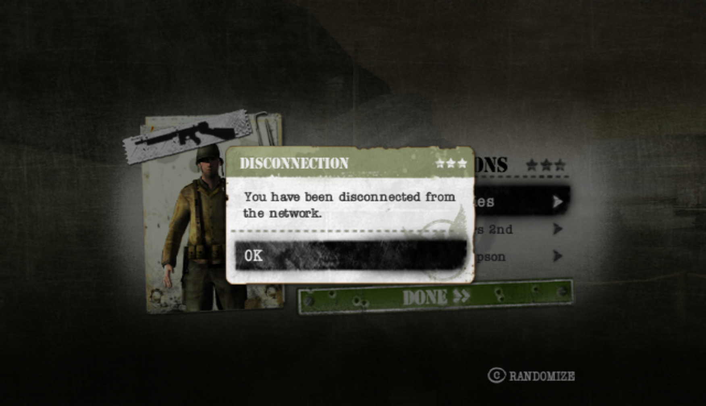

# Medal Of Honor Heroes 2 Server [Wii]

Designed to replace EA's closed ones.  

## Discord

Link : https://discord.gg/fwrQHHxrQQ  

It is used to :
- Talk about the game
- Share technical knowledge
- Centralize documentation
- Regroup the community and organize events when we'll be ready (hopefully)

Fell free to join !

## Wiki

Everything to know is in the [Wiki](https://github.com/a-blondel/mohh2-wii-server/wiki).  
It contains :
- Generic info about the game (weapons, maps,...)
- Technical knowledge (packet capture, ...)

## Development Status

**Work In Progress**

 <br/>
*Player details / Leaderboards*

 <br/>
*Lobbies / Game joining*

<br/>
*Disconnection*

**Features**
- [x] Access Nintendo WFC (Riivolution patch with Wiimmfi)
- [ ] EA account management
  - [x] Create account
  - [x] Update account
  - [x] Use account
  - [x] Create persona
  - [x] Delete persona
  - [x] Use persona
  - [ ] Account recovery (require SMTP)
  - [ ] Password reset (require SMTP)
- [ ] Main menu
  - [x] Player info (Country, Kills, Deaths, Score, Rank, Reputation)
  - [ ] Online player count
- [ ] Lobby
  - [x] Games available
  - [x] Players in game (partially : player list is done, players details isn't)
  - [ ] Filter options
  - [x] Create game (almost complete : password protected lobbies isn't handled yet)
  - [x] Join game (almost complete : password protected lobbies isn't handled yet)
- [ ] In game
  - [ ] Team, uniform and weapon selection screen (disconnected just before)
  - [ ] --anything else to handle that we are not aware of yet--
- [x] Leaderboards
  - [x] My EA Leaderboard
  - [x] EA Top 100
  - [x] EA Weapon Leaders
- [ ] My profile
  - [ ] FAQ
  - [ ] Terms and conditions
- [ ] EA Messenger
  - [ ] List recently met people (unsure ?)
  - [ ] List online/offline people and which game they play (friends/blocked/friend request)
  - [ ] Send message
  - [ ] Send friend request
  - [ ] Block
  - [ ] Comment

Note that error messages eg 'invalid password'/'unknown account' are more or less complete.


## Requirements

### 1/ Riivolution patches

To make the game to use this server you need to activate Riivolution patches when starting the game.  
Patches can be found here : https://github.com/a-blondel/mohh2-wii-patch

### 2/ Hosts file

In order to intercept requests from the game, you must add this line to your hosts file (`C:\Windows\System32\drivers\etc`) :
```
127.0.0.1 wiimoh08.ea.com
```

### 3/ JDK

This project has been initiated with the `JDK 17`, download it if needed.

### 4/ Maven

If you downloaded Intellij, Maven comes bundled with one, otherwise download the latest version of Maven.

#### Maven profile

**Some properties like the SSL port are region-dependant, therefore they must be changed accordingly to the version of the game.**  
A maven profile exists for each region:
- `pal` : RM2X69 and RM2P69
- `ntsc` : RM2E69

Currently, all profiles are located in *application.yml* as there won't be many region-based properties.  
**When you don't specify any maven profile, it fallbacks to `pal`.**


## Run the server

### 1. Build the project

Run the following command :  
`mvn clean package`

### 2.a Start the server in Intellij

Create a new Application config in Intellij and set the following entry-point (main class) :
```
com.ea.ServerApp
```

If you need to specify a profile, be sure to check `Add VM options` (or use Alt+V), then fill the field with :
```
-Dspring.profiles.active=ntsc
```

### 2.b Start as a standalone jar

After a successful build, get into the target folder and execute the following command:
```
java -jar mohh2-wii-server-1.0.0-SNAPSHOT.jar
```

If you need to specify a profile, use :
```
java -jar -Dspring.profiles.active=ntsc mohh2-wii-server-1.0.0-SNAPSHOT.jar
```

## Database

For development, an embedded database is used.  
See `data.sql` (default file) & `data-full.sql` (leaderboards sample) for available data on start.  
It can be accessed in a browser when the server is running :  
```
http://localhost:8080/h2/
```

Configuration like database url, user and password can be found in `application.yml`.
